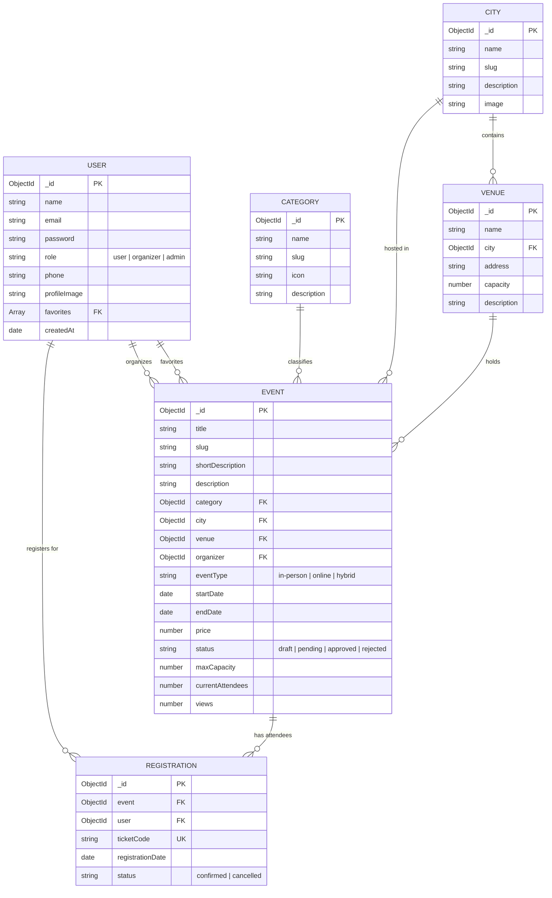

# EVENTORIA - Entity-Relationship (ER) Database Diagram

```mermaid
erDiagram
    USER ||--o{ EVENT : "organizes"
    USER ||--o{ REGISTRATION : "registers for"
    USER ||--o{ EVENT : "favorites"
    CATEGORY ||--o{ EVENT : "classifies"
    CITY ||--o{ VENUE : "contains"
    CITY ||--o{ EVENT : "hosted in"
    VENUE ||--o{ EVENT : "holds"
    EVENT ||--o{ REGISTRATION : "has attendees"

    USER {
        ObjectId _id PK
        string name
        string email
        string password
        string role "user | organizer | admin"
        string phone
        string profileImage
        Array favorites FK
        date createdAt
    }

    CATEGORY {
        ObjectId _id PK
        string name
        string slug
        string icon
        string description
    }

    CITY {
        ObjectId _id PK
        string name
        string slug
        string description
        string image
    }

    VENUE {
        ObjectId _id PK
        string name
        ObjectId city FK
        string address
        number capacity
        string description
    }

    EVENT {
        ObjectId _id PK
        string title
        string slug
        string shortDescription
        string description
        ObjectId category FK
        ObjectId city FK
        ObjectId venue FK
        ObjectId organizer FK
        string eventType "in-person | online | hybrid"
        date startDate
        date endDate
        number price
        string status "draft | pending | approved | rejected"
        number maxCapacity
        number currentAttendees
        number views
    }

    REGISTRATION {
        ObjectId _id PK
        ObjectId event FK
        ObjectId user FK
        string ticketCode UK
        date registrationDate
        string status "confirmed | cancelled"
    }
```
