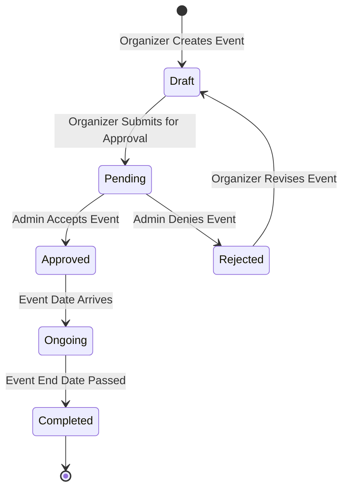
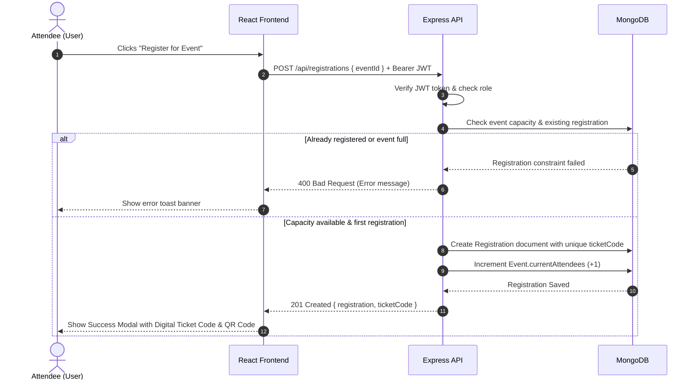

# EVENTORIA - Event Lifecycle & Registration Workflows

## 1. Event Moderation Lifecycle State Diagram

```mermaid
stateDiagram-v2
    [*] --> Draft: Organizer Creates Event
    Draft --> Pending: Organizer Submits for Approval
    Pending --> Approved: Admin Accepts Event
    Pending --> Rejected: Admin Denies Event
    Rejected --> Draft: Organizer Revises Event
    Approved --> Ongoing: Event Date Arrives
    Ongoing --> Completed: Event End Date Passed
    Completed --> [*]
```

## 2. User Ticket Registration Sequence Diagram

```mermaid
sequenceDiagram
    autonumber
    actor User as Attendee (User)
    participant UI as React Frontend
    participant API as Express API
    participant DB as MongoDB

    User->>UI: Clicks "Register for Event"
    UI->>API: POST /api/registrations { eventId } + Bearer JWT
    API->>API: Verify JWT token & check role
    API->>DB: Check event capacity & existing registration
    alt Already registered or event full
        DB-->>API: Registration constraint failed
        API-->>UI: 400 Bad Request (Error message)
        UI-->>User: Show error toast banner
    else Capacity available & first registration
        API->>DB: Create Registration document with unique ticketCode
        API->>DB: Increment Event.currentAttendees (+1)
        DB-->>API: Registration Saved
        API-->>UI: 201 Created { registration, ticketCode }
        UI-->>User: Show Success Modal with Digital Ticket Code & QR Code
    end
```
